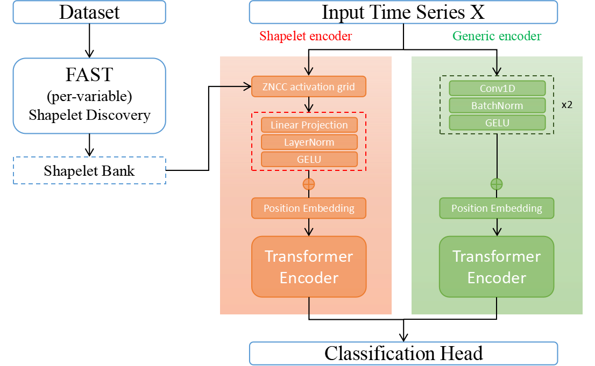

# STAR: Shapelet-Temporal trAnsformeR

**STAR** comprises two transformer encoders that operate on complementary tokenisations of the input. 

The first is a *shapelet encoder*: we build a shapelet bank with per-variable FAST application, compute zero-normalised cross-correlation activation trajectories, align them on a common time grid, and project the resulting activation matrix into a token sequence with learned positional encodings before transformer encoding. 

The second is a *generic encoder* that forms tokens directly from the raw multivariate series using a lightweight convolutional front-end and a transformer to supply generic temporal context. The two sequence representations are pooled and fused before classification. 
Figure below summarised the overall architecture of STAR. 





## Environment

We recommend Python **3.10–3.11**. 


## Quick start

Run a single dataset:

```bash
# from the repo root
python -m main \
    --dataset BasicMotions \
    --epochs 200 --batch_size 16 \
    --d_model 128 --n_layers 1 --n_heads 16 --pooling cls --dropout 0.4 \
    --gen_raw 1 --gen_diff 0 --gen_d_model 32 --gen_layers 1 --gen_heads 16 --gen_dropout 0.4 \
    --optimizer radam --lr 1e-2 --weight_decay 5e-4 \
    --include_max 0 --k369 1 --kernel_budget_total 50000 --top_k_per_var 100 \
    --threads 20 --use_val 1 --val_frac 0.2 --early_stop_patience 5 --early_stop_min_delta 1e-4
```


